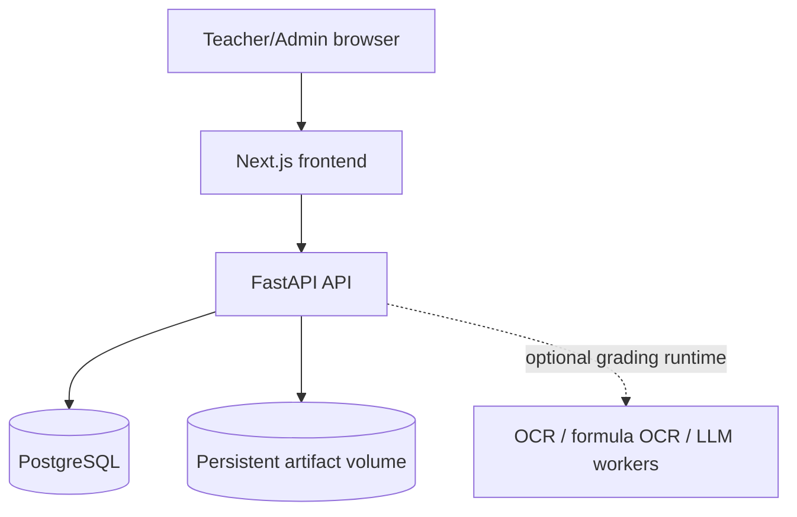

# llm-grader

## Runtime hardware prerequisites

- **NVIDIA:** Install the NVIDIA driver and Container Toolkit. Verify GPU visibility
  with `docker run --rm --gpus all nvidia/cuda:12.8.1-base-ubuntu24.04 nvidia-smi`.
- **AMD:** Configure the kernel GPU driver and `/dev/dri` render devices; ROCm also
  requires `/dev/kfd` and a compatible ROCm binary. The standard image uses Vulkan
  for AMD, including devices unsupported by ROCm.
- **CPU:** No GPU configuration is required.

After cloning, configure deployment credentials and place model files in model
storage. `docker compose up -d --build` starts the CPU-safe baseline. For automatic
host GPU exposure without editing Compose, use
`python3 scripts/runtime-compose.py` (defaults to `up -d --build`). Docker Compose
cannot conditionally request missing GPU devices, so plain Compose does not
promise GPU passthrough on every host.

RuntimeManager selects usable CUDA → ROCm → Vulkan → CPU backends at startup.
GPU unavailability falls back to CPU in `auto` mode. Missing models do not stop
the application. Check `/api/v1/system/runtimes` for hardware/backend status;
`LLM_GRADER_RUNTIME_BACKEND` provides an optional override. Model download and
Admin runtime controls remain future work. See
[runtime deployment](docs/operations/runtime-deployment.md) for detailed setup.

## Overview

llm-grader is a web application for human-in-the-loop, LLM-assisted grading of university assessments. Teachers manage tests, questions, model answers, rubrics, and student submissions in a browser. OCR, formula recognition, and LLM grading provide evidence for teacher review; the system does not replace teacher judgment.

## Features

- PostgreSQL-backed FastAPI and Next.js web application
- Admin and Teacher authentication with HttpOnly sessions
- First-run setup wizard for the initial administrator
- Admin user management and teacher/course ownership boundaries
- Course, test, question, model-answer, and rubric workflows
- Student answer image/PDF preview and reconstruction review
- Grading, review queue, regrade, finalization, results, CSV, and PDF views
- Persistent artifact storage, Alembic migrations, and Docker Compose deployment

Model/runtime catalog and download management are not part of the current web administration surface. Normal Compose includes a lazy-starting RuntimeManager and managed llama-server. Model files must be provisioned separately; Ricoh requires its own runtime configuration; Uni-MuMER math OCR has a configurable `math_ocr` profile and requires model/mmproj files. See [runtime deployment](docs/operations/runtime-deployment.md).

## Screenshots

Publishable screenshots are not currently checked in. Capture them from a fresh/demo environment before publishing; never use real student data, credentials, tokens, or private email addresses.

## Architecture



The browser uses the frontend `/api/v1` proxy and does not resolve an internal Compose service name directly.

## Requirements

The supported deployment path requires Git, Docker Engine, and the Docker Compose plugin. Python, Node.js, and PostgreSQL are not required on the host.

## Quick Start with Docker Compose

```bash
git clone https://github.com/fujisawa-max/llm-grader.git
cd llm-grader
cp .env.example .env
docker compose up -d --build
```

Change `POSTGRES_PASSWORD` and deployment-specific settings in `.env` first. Defaults are frontend `3000`, API `8000`, and PostgreSQL `5432`.

## First-run Setup

On an empty database, opening the frontend routes to `/setup` because the API reports `setup_required=true`. Enter the administrator display name, email, password, and confirmation, complete setup, then follow the link to `/login`. The backend accepts initialization only while no active administrator exists; afterward `/setup` and the initialize API are disabled.

## Basic Web Workflow

`Admin creates Teacher → Teacher signs in → creates and edits a Course (year and term together) → creates a Test → registers the question sheet and model-answer source → adds student answer files in batches with explicit student mapping → reviews Questions, Model Answers, and Rubrics → reviews answer extraction/reconstruction → grading → results and CSV/PDF export`.

Question sheets and model-answer sources support PNG, JPEG, and PDF files. Student answer files can be grouped in page order by student. Uploading files only registers and previews the source; it does not automatically start OCR, reconstruction, or grading. Question PDF parsing is a separate explicit action.

## Math notation

Question text, model answers, and rubric criteria accept LaTeX source. Use `$P=\frac{TP}{TP+FP}$` within a sentence or `$$\sum_{i=1}^{n}x_i$$` for a separate formula. A field containing only a LaTeX command such as `\frac{1}{3}` also renders as math. The editor saves the original source text and shows a separate KaTeX preview; it does not store rendered HTML. Unsupported syntax remains visible as source text.

## User Roles

**Admin** manages users and can access all courses and tests. **Teacher** manages their own courses and the grading workflow below those courses. Backend authorization enforces ownership.

## Data Persistence

Compose stores PostgreSQL data in `postgres_data` and artifacts in `artifacts_data`. `docker compose down` preserves both; `docker compose down -v` removes them and is a destructive development reset.

## Updating

Run `git pull`, `docker compose build`, and `docker compose up -d`. The one-shot `migrate` service applies pending Alembic migrations before the API starts. Do not reset the database for an update.

## Stopping / Restarting

Use `docker compose restart` for a restart or `docker compose down` to stop. Start again with `docker compose up -d`; named volumes remain intact.

## Development

Python sources are under `src/`, migrations under `migrations/`, and the Next.js app under `frontend/`. Outside Docker, create a virtual environment and run `pip install -e '.[dev]'`; install frontend dependencies with `npm ci` in `frontend`.

## Testing

Use `.venv/bin/python -m unittest discover -s tests -v`, `.venv/bin/python -m pytest -q`, `.venv/bin/ruff check src tests`, and in `frontend`, `npm run typecheck`, `npm run lint`, and `npm run build`. Browser E2E uses `npm run e2e` with a provisioned Playwright/Chromium installation.

## Documentation

- [Production runbook](docs/operations/production-runbook.md)
- [Backup and restore](docs/operations/backup-restore.md)
- [Incident response](docs/operations/incident-response.md)
- [Deployment checklist](docs/operations/deployment-checklist.md)
- [Q5 PostgreSQL cutover notes](docs/operations/q5-postgres-cutover.md)
- [Reports](docs/reports/)

## Current Limitations / Planned Features

Model catalog, model download/install, and runtime switching UI are not yet implemented. Complete fresh-machine browser E2E still requires a provisioned Chromium environment. Production deployments should add HTTPS, operational secret management, and a tested backup/restore environment. KaTeX supports a subset of LaTeX; additional model/runtime integrations remain ongoing work.

## Security Notes

Never commit `.env`, credentials, database dumps, or model files. Replace the example PostgreSQL password before deployment. Header authentication is disabled by default. Use HTTPS at the reverse proxy in production. Passwords are hashed; plaintext passwords and session tokens must not be logged or placed in documentation or screenshots.

Model Answer Review offers on-demand “数式をLaTeX化”. Source-backed formulas use bounded PDF crops and Uni-MuMER, then show a proposal and source preview for teacher confirmation. Apply changes only the editing draft; draft save and formal registration remain separate. See [runtime deployment](docs/operations/runtime-deployment.md) for math model storage settings.
